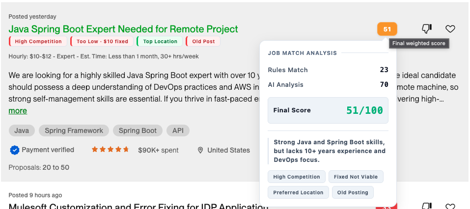
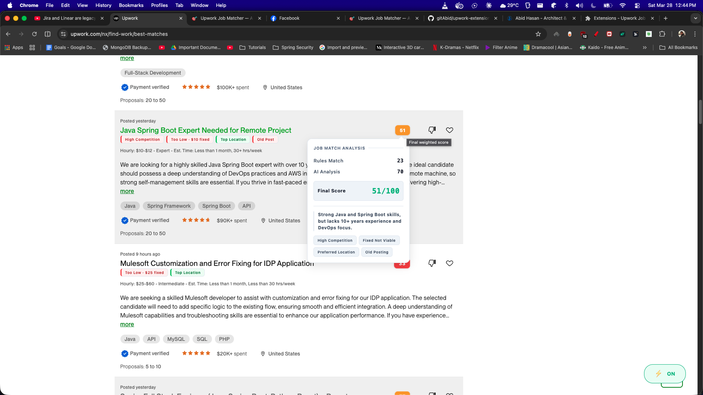
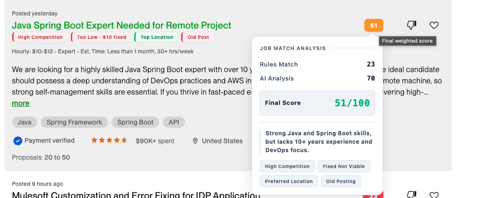
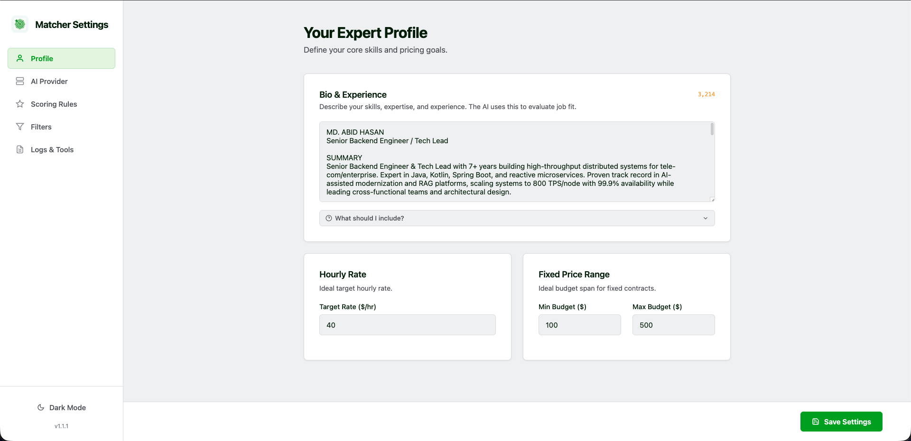
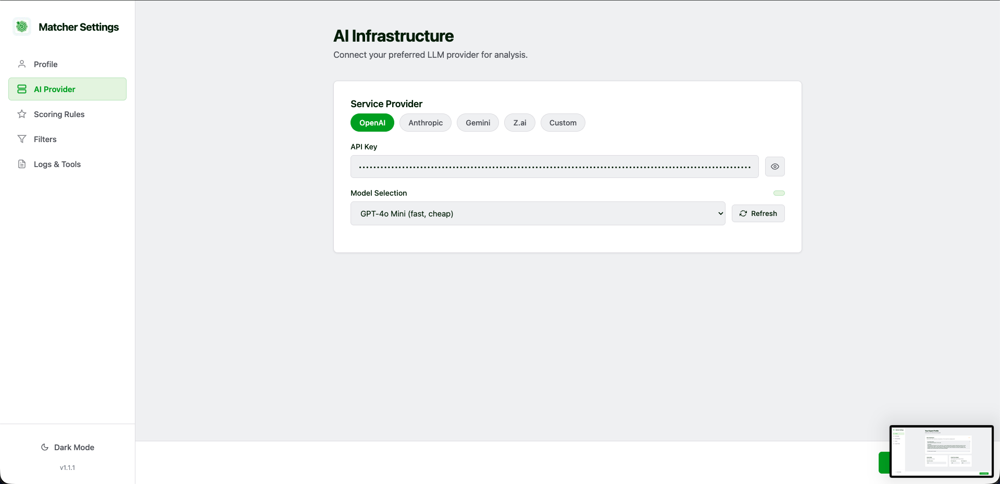
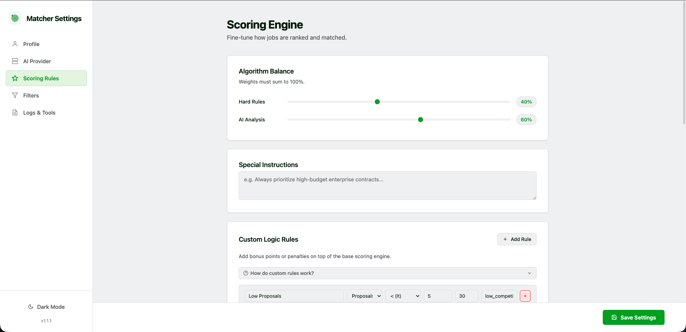
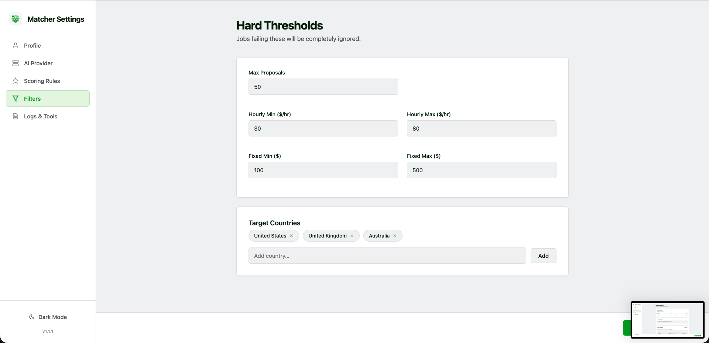
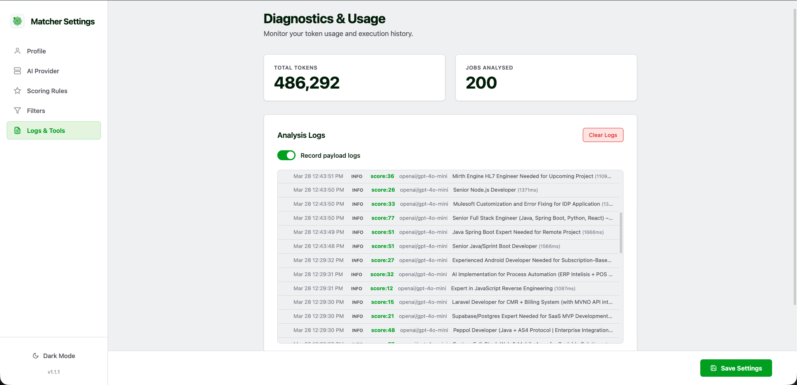

# Upwork Job Matcher

> AI-powered Chrome extension that scores Upwork job listings against your profile using a hybrid scoring system — rules-based analysis combined with optional LLM intelligence.

<p align="center">
  
  
  
</p>

---

## Screenshots

### Job Cards with Score Badges

Score badges and dollar-hint flag pills are injected directly into Upwork job cards:



### Extension Popup

Quick stats and extension status at a glance:

| Overview | Stats |
|:---:|:---:|
|  |  |

### Settings Panel

Configure your profile, AI provider, scoring rules, and display preferences:

| Profile | AI Provider | Scoring & Rules |
|:---:|:---:|:---:|
|  |  |  |

| Logs & Token Usage | Display |
|:---:|:---:|
|  |  |

---

## Features

- **Hybrid Scoring** — Combines fast rules-based analysis (budget, proposals, location, posting time) with deep LLM evaluation (skills match, experience alignment, project scope)
- **Real-Time Badge Injection** — Score badges and colored flag pills appear directly on Upwork job cards as you browse
- **Smart Budget Analysis** — Sophisticated hourly rate and fixed-price comparison against your personal rate/range, with fallback thresholds
- **5 AI Providers** — OpenAI, Anthropic (Claude), Google Gemini, Z.ai, and custom OpenAI-compatible endpoints
- **Stack-Based Optimization** — Skip LLM analysis for jobs that don't match your tech stack keywords, saving API costs
- **Custom Scoring Rules** — Define your own rules with operators (`<`, `>`, `range`, `contains`, `in`) and point values
- **Adjustable Weights** — Tune the rules-to-LLM weight ratio (default: 40% rules, 60% LLM)
- **Request Queue** — Background service worker manages up to 3 concurrent LLM calls with automatic queuing
- **Token Usage Tracking** — Monitor API costs per provider and model
- **Dark Mode** — Full dark mode support across settings and popup
- **On/Off Toggle** — Floating toggle button on Upwork pages to enable/disable scoring instantly
- **Manual Analysis** — Click to trigger LLM analysis on optimization-skipped jobs
- **Detailed Tooltips** — Hover over score badges to see rules score, AI score, final weighted score, and reasoning

---

## How It Works

1. **Scrape** — The content script observes job cards on Upwork via `MutationObserver` and extracts title, budget, skills, location, proposals, and posting time
2. **Rules Score** — Applies inlined rules-based scoring (proposals, budget comparison, client location, posting recency) → 0–100
3. **LLM Score** — Sends job data + your profile to an AI provider for skills and experience matching → 0–100
4. **Combine** — Final weighted score: `(rulesScore × rulesWeight + llmScore × llmWeight) / 100`
5. **Display** — Injects a score badge with separate `R:` and `AI:` chips plus colored flag pills into each job card

---

## Installation

### Manual Install (Developer Mode)

1. [Download or clone](https://github.com/your-username/upwork-extension) this repository
2. Open **chrome://extensions/** in Google Chrome
3. Enable **Developer mode** (toggle in the top-right corner)
4. Click **Load unpacked**
5. Select the project root folder (the folder containing `manifest.json`)

The extension icon will appear in your toolbar. Navigate to [upwork.com/nx/find-work/](https://www.upwork.com/nx/find-work/) to start scoring jobs.

---

## Configuration

### Quick Start

1. **Click the extension icon** → **Settings** (gear icon)
2. **Set your profile** — Skills, experience, preferred hourly rate, and fixed-price range
3. **Add an API key** — Choose a provider (OpenAI recommended) and paste your key
4. **Browse jobs** — Visit Upwork's find-work or search pages; scores appear automatically

### Settings Sections

| Section | Description |
|---|---|
| **Profile** | Your skills, experience level, target countries, hourly rate, and fixed-price range |
| **AI Provider** | Provider selection, API key, model picker (with dynamic model fetching) |
| **Scoring** | Rules/LLM weight slider, custom rules editor, stack keywords |
| **Display** | Score thresholds (green/yellow), dark mode toggle |
| **Logs** | Optional request logging (up to 200 entries), token usage per provider |

---

## Scoring System

### Rules-Based Scoring (40% by default)

Raw points (max 130, normalized to 0–100):

| Factor | Criteria | Points | Flag |
|---|---|:---:|---|
| **Proposals** | < 5 | 30 | Low Competition |
| | 5–14 | 20 | — |
| | 15–29 | 10 | — |
| | 30–49 | 5 | High Competition |
| | 50+ | 0 | High Competition |
| **Hourly Rate** (user rate set) | Your rate below client minimum | 0 | Below Minimum |
| | Budget friendly (low → midpoint) | 30 | Budget Friendly |
| | Near top of range (midpoint → high) | 25 | Near Top of Range |
| | Above market (high → 1.5× high) | 15 | Above Market |
| | Premium (> 1.5× high) | 5 | Premium |
| **Hourly Rate** (no user rate) | $30–80/hr | 30 | Budget Match |
| | $81–150/hr | 20 | Budget High |
| | $20–29/hr | 15 | Budget Low |
| | <$20/hr | 0 | Budget Low |
| **Fixed Price** (user range set) | Below your minimum | 0 | Not Viable |
| | Your min → midpoint | 20 | Acceptable |
| | Midpoint → your max | 30 | Good Fit |
| | Above your max | 35 | Premium Opportunity |
| **Fixed Price** (no user range) | $100–500 | 30 | Budget Match |
| | $501–1,000 | 20 | Budget High |
| | >$1,000 | 15 | Budget High |
| | <$100 | 5 | Budget Low |
| **Client Location** | US, UK, Australia | 25 | Top Location |
| | Canada | 15 | Good Location |
| | Western Europe | 10 | OK Location |
| | Other | 0 | — |
| **Posting Time** | < 1 hour | 15 | Just Posted |
| | 1–6 hours | 10 | Recent |
| | 6–24 hours | 5 | — |
| | > 1 day | 0 | Old Post |

### LLM Scoring (60% by default)

When enabled, job data and your profile are sent to the selected AI provider for deep analysis:

- **Skills match** — How well the job's required skills align with your profile
- **Experience alignment** — Whether the experience level matches yours
- **Project scope** — Feasibility and relevance of the project description

### Final Score

```
Final = (rulesScore × rulesWeight + llmScore × llmWeight) / 100
```

| Score Range | Color | Meaning |
|:---:|:---:|---|
| 80–100 | Green | Strong match — apply |
| 50–79 | Yellow | Moderate match — review |
| 0–49 | Red | Weak match — likely skip |

---

## Supported AI Providers

| Provider | Models | Notes |
|---|---|---|
| **OpenAI** | GPT-4o, GPT-4o Mini, GPT-3.5 Turbo | Models fetched dynamically from API |
| **Anthropic** | Claude 3.5 Sonnet, Claude 3.5 Haiku, Claude 3 Haiku | Models fetched dynamically |
| **Google Gemini** | Gemini 2.0 Flash, Gemini 1.5 Pro, Gemini 1.5 Flash | Models fetched dynamically |
| **Z.ai** | Z1 Pro, Z1, Z1 Mini | Models fetched dynamically |
| **Custom** | Any OpenAI-compatible endpoint | User provides URL and model name |

Models are fetched dynamically from each provider's API when you select a provider in settings.

---

## Development

### Project Structure

```
upwork-extension/
├── manifest.json                 # Extension manifest (MV3)
├── background/
│   └── service-worker.js         # LLM API calls, request queue, token tracking
├── content/
│   ├── content.js                # Job card scraping, rules scoring, badge injection
│   └── content.css               # Badge and flag pill styles
├── settings/
│   ├── settings.html             # Configuration UI
│   ├── settings.js               # Settings logic, model fetching, live preview
│   └── settings.css              # Settings styles (light + dark mode)
├── popup/
│   ├── popup.html                # Extension popup
│   ├── popup.js                  # Popup logic (stats, status)
│   └── popup.css                 # Popup styles
├── shared/
│   ├── constants.js              # Storage keys, defaults, provider configs
│   └── scoring.js                # Pure rules-based scoring functions
├── icons/
│   ├── icon16.png
│   ├── icon48.png
│   └── icon128.png
└── LICENSE.md                    # MIT License
```

### Tech Stack

- **Vanilla JavaScript** — ES6 modules, no build process or frameworks
- **Chrome Extension Manifest V3** — Service worker, content scripts, `chrome.storage` API
- **No dependencies** — All code is loaded directly by Chrome

### Development Workflow

1. **Load the extension** via `chrome://extensions/` → Load unpacked
2. **Edit files** in your editor — changes are reflected immediately
3. **Reload components:**
   - **Service worker**: Click "Reload" on the extension card (or the service worker link)
   - **Content script**: Refresh the Upwork page
   - **Settings page**: Close and reopen the settings tab

### Debugging

| Component | How to Debug |
|---|---|
| Content script | Inspect a job card element → Console shows `[UJM]` prefixed logs |
| Service worker | `chrome://extensions/` → "Service worker" link opens DevTools |
| Settings | Right-click settings page → Inspect |

### Key Constraints

- Content scripts cannot import ES modules — all constants used by `content/content.js` must be **inlined** (see `STORAGE_KEYS` in both `shared/constants.js` and `content/content.js`)
- `chrome.storage.sync` has a 100KB quota (8KB per item)
- Service worker terminates after 30s idle — queue state resets
- `MutationObserver` may fire multiple times per DOM change — a `WeakSet` tracks processed cards

---

## Contributing

Contributions are welcome! Here's how to get started:

1. **Fork** this repository
2. **Create a branch**: `git checkout -b feature/your-feature-name`
3. **Make your changes** following the patterns below
4. **Test** by loading the extension in Chrome and verifying on upwork.com
5. **Commit** with a clear message: `git commit -m "Add: description of change"`
6. **Push** and open a **Pull Request**

### Coding Conventions

- Vanilla JS only — no external dependencies
- ES6 module syntax for background and settings; inlined code for content scripts
- Use `STORAGE_KEYS` constants from `shared/constants.js` — never string literals
- When adding a new storage key, **inline it in `content/content.js`** as well (content scripts can't import modules)
- Follow existing patterns for API calls, storage reads/writes, and DOM injection

### Adding a New User Setting

1. Add storage key to `shared/constants.js` → `STORAGE_KEYS`
2. Inline the same key in `content/content.js` → `STORAGE_KEYS`
3. Add UI field to `settings/settings.html`
4. Add DOM ref in `settings/settings.js` → `initDOMRefs()`
5. Add load logic in `settings/settings.js` → `loadSettings()`
6. Add save logic in `settings/settings.js` → `saveSettings()`
7. Add a `chrome.storage.onChanged` listener in `content/content.js` if the content script needs to react to changes

### Adding a New AI Provider

1. Add to `shared/constants.js` → `PROVIDER_URLS`, `PROVIDER_MODELS`, `DEFAULT_MODELS`
2. Add a `fetch*Models()` function in `background/service-worker.js`
3. Add the provider case in `background/service-worker.js` → `callLLM()` switch statement
4. Add the provider option in `settings/settings.html` provider radio group

---

## License

This project is licensed under the MIT License — see [LICENSE.md](LICENSE.md) for details.
